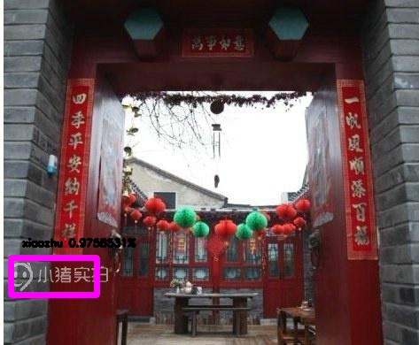

# YOLO-v1 implemented by pytorch.
*This is just an experimental code to deepen the understanding of YOLO-v1. The overall design is based on YOLO-v1, but some structures have been changed, such as using deep separable convolutions and discarding fully connected layers. And i generated watermark data to verify the validity of the network.*

----
## train
### prepare training data, voc format
    
    data/
        imgs/
            ...
        annotations/
            ...

### Specify category name list and your hyper-parameter in train.py

----
## detect

```shell script
python detect.py --input_path XXXXX
```

## result
<div><div align="left">


</div>
</div>


## yolo-v2 implemented by myself on the way!!!

## ref
[yolo-v1](https://pjreddie.com/darknet/yolov1/)